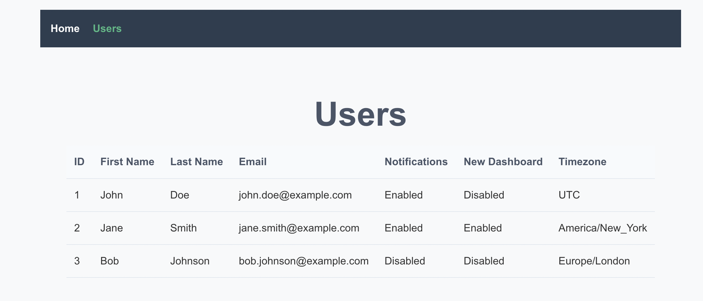

# My-Account Frontend

## 📋 Overview

A responsive web interface built with Vue.js to interact with the My-Account backend API.

### Key Features
- Responsive design optimized for desktop, tablet, and mobile devices
- Clean and intuitive user interface
- Seamless integration with My-Account backend API
- Real-time data visualization
- User-friendly error handling

## 🖼️ UI Preview



*User list interface showing responsive table with user details and settings*

## 🚀 Getting Started

### Prerequisites
- Node.js 18 or higher
- npm package manager
- My-Account Backend API running

### Installation

1. Clone the repository:
```bash
git clone https://github.com/your-username/my-account-frontend.git
cd my-account-frontend
```

2. Install dependencies:
```bash
npm install
```

3. Configure environment:
   - Copy `.env.example` to `.env`
   - Update environment variables:
```env
VITE_API_URL=http://localhost:3000
```

### Running the Application

```bash
# Development mode
npm run dev

# Build for production
npm run build

# Preview production build
npm run preview
```

The development server will start at [http://localhost:5173](http://localhost:5173)

## 🏗️ Project Structure

```
my-account-frontend/
├── public/                 # Static assets
│   ├── favicon.ico
│   └── index.html         # HTML entry point
├── src/
│   ├── assets/            # Static assets
│   │   └── vue.svg        # Vue logo
│   ├── components/        # Vue components
│   │   └── UserList.vue   # User list component
│   ├── router/            # Vue Router configuration
│   │   └── index.js       # Router setup
│   ├── services/          # API services
│   │   └── userService.js # User data service
│   ├── views/             # Vue views/pages
│   │   ├── HomeView.vue   # Home page
│   │   └── UsersView.vue  # Users page
│   ├── App.vue            # Main Vue component
│   ├── main.js            # Application entry point
│   └── style.css         # Global styles
```

## 🔌 API Integration

### Expected API Response Format
```json
[
  {
    "id": 1,
    "firstName": "John",
    "lastName": "Doe",
    "email": "john.doe@example.com",
    "settings": {
      "isNotificationEnabled": true,
      "isNewDashboardEnabled": false,
      "timezone": "UTC"
    }
  }
]
```

## 🧪 Testing

1. Ensure backend API is running
2. Start frontend application: `npm run dev`
3. Navigate to [http://localhost:5173/users](http://localhost:5173/users)
4. Test responsive design using browser dev tools

## 📦 Deployment

1. Build the production version:
```bash
npm run build
```

2. Deploy the `dist` directory to your preferred hosting:
   - GitHub Pages
   - Netlify
   - Vercel
   - AWS S3
   - Firebase Hosting

## ⚙️ Customization

- **API URL**: Update `VITE_API_URL` in `.env`
- **Styling**: Modify `src/style.css` or component styles
- **Routes**: Configure in `src/router/index.js`

## 🔍 Troubleshooting

### API Connection Issues
- Verify backend server status
- Check `VITE_API_URL` configuration
- Look for CORS errors in browser console

### Display Issues
- Check browser console for errors
- Verify API response format
- Clear browser cache

### Build Problems
- Clear `node_modules` and reinstall
- Verify Node.js version (18+)
- Check for dependency conflicts

## 🤝 Contributing

1. Fork the repository
2. Create feature branch (`git checkout -b feature/amazing-feature`)
3. Commit changes (`git commit -m 'Add amazing feature'`)
4. Push to branch (`git push origin feature/amazing-feature`)
5. Open a Pull Request

## 📄 License

MIT

## 🙏 Acknowledgments

- Vue.js
- Vite
- Axios

## 🔗 Related Projects

- my-account-shared-orm-library
- my-account-backend
- my-account-frontend